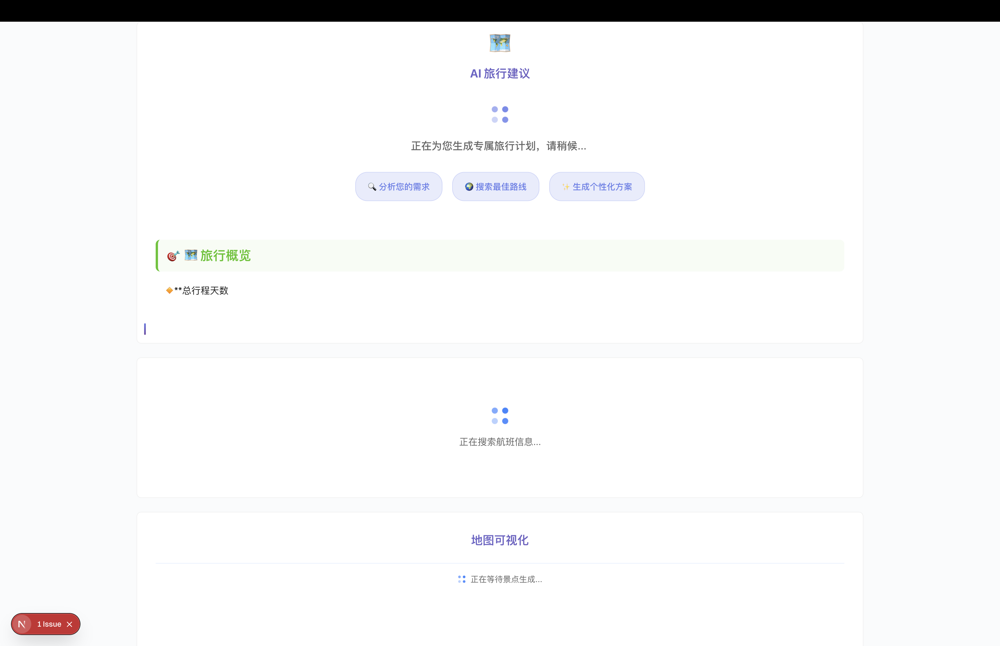
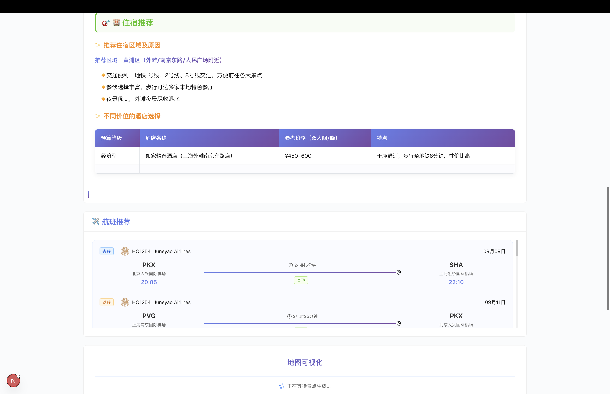
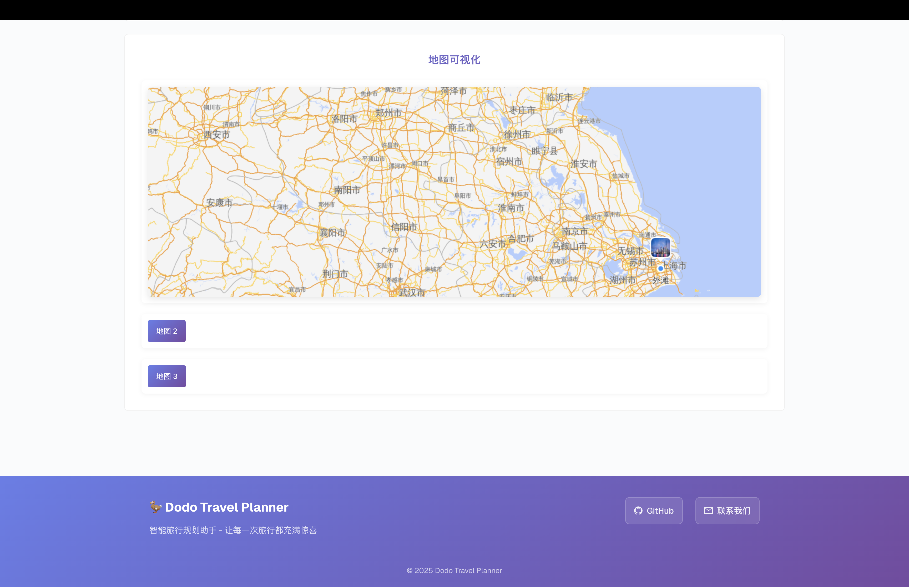
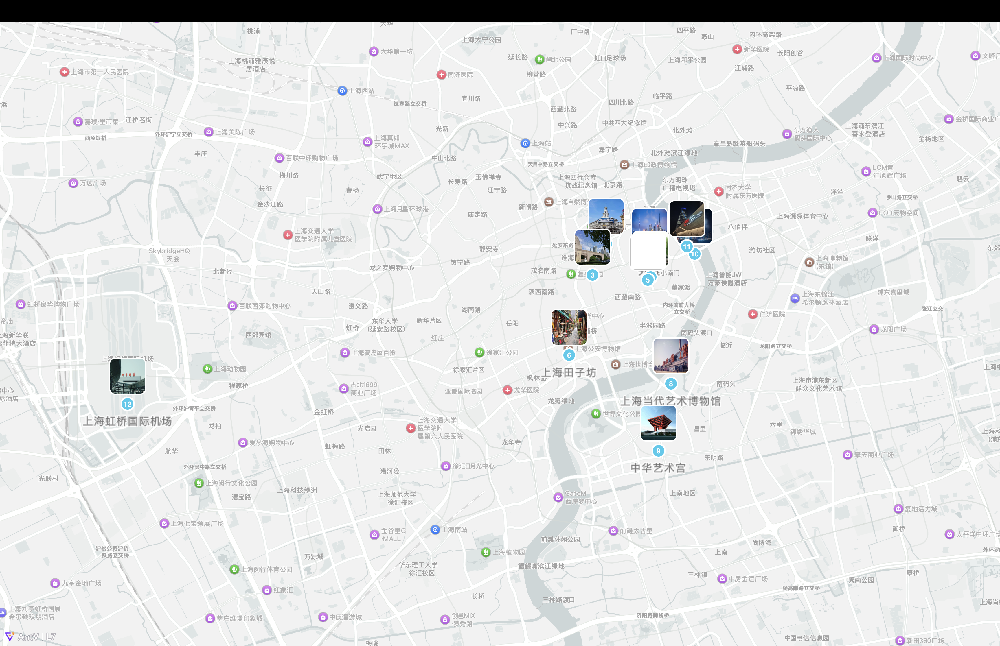

# 🦤 Dodo 旅行规划助手 🦤

## 📖 项目简介

Dodo 旅行规划助手是一个基于 LLM 的智能旅行规划平台，为用户提供个性化、智能化的出行建议。通过整合多种 AI 技术和实时数据源，为每一次旅行创造独特的体验。

### ✨ 核心功能

- 🤖 **AI 智能规划** - 基于 FastAPI & LangChain 的智能系统，提供个性化旅行建议
- ✈️ **实时航班查询** - 集成 Booking 航班 API，实时获取最新航班信息
- 📊 **数据可视化** - 使用 AntV MCP Server 展示旅行地图
- 💬 **流式对话** - Server-Sent Events 实现实时 AI 输出体验
- 🎯 **多维度需求** - 支持预算、偏好、特殊需求等多维度定制化规划

## 🎬 运行示例

### 🏠 首页

### 📋 行程推荐
用户输入示例

### 🎨 界面展示
运行中界面示例

### ✈️ 航班推荐

### 🗺️ 旅程地图
使用 AntV MCP Server 构建的交互式地图可视化，展示旅行中的关键兴趣点分布

## 🛠️ 技术栈

### 前端 Frontend 🎨
- ⚡ **Next.js 15** - 现代化 React 全栈框架
- 🎨 **Ant Design 5** - 企业级 UI 设计语言

### 后端 Backend 🔧
- 🐍 **FastAPI** - 现代高性能 Python Web 框架
- 🦜 **LangChain** - 先进的 LLM 应用开发框架
- ☁️ **阿里云百炼** - 企业级 AI 服务平台
- 🗺️ **AntV L7/Vis MCP** - 专业地理数据可视化组件

---

## 🚀 快速开始

### 📋 前置要求

- 📱 **Node.js** >= 18.0.0
- 🐍 **Python** >= 3.12
- 📦 **UV** - Python 包管理器

### 🔧 安装步骤文档

- 📖 [前端说明文档](fe/docs/readme.md)
- 📖 [后端说明文档](be/docs/readme.md)

## 🎯 核心特性

参考 [NVIDIA AIQ](https://github.com/NVIDIA/NeMo-Agent-Toolkit) 中相关组件 (如 React Agent, MCP 调用) 的实现思路并以此作为灵感的前提下，使用 [Langchain](https://www.langchain.com/)，[阿里云百炼](https://bailian.console.aliyun.com/)，[阿里云魔搭社区](https://modelscope.cn/my/overview)，等能力构建的智能旅行助手。

### 🗺️ 行程推荐

基于 LangChain 框架和阿里云百炼平台的 Qwen 大模型，通过精心设计的 Prompt 模板，为用户生成个性化的旅行行程建议。

系统会根据用户的输入智能推荐包含 🏛️ **热门景点** 🍽️ **美食体验** 🏨 **住宿建议** ⏰ **时间安排** 💰 **预算估算** 等元素，通过多轮对话优化和实时调整，确保每一份行程都能完美匹配用户的个性化需求。

### ✈️ 航班推荐

首先通过 LLM 的能力将用户输入的城市转化为标准 IATA 城市代码，再通过 [Rapid API](https://rapidapi.com/) 平台提供的 Booking 航班接口获取🛫出发地和🎯目的地的实时航班信息，从而实现为用户的旅程推荐适合的航班。

### 📊 数据可视化
在 LLM 根据用户的🛫出发地、🎯目的地、📅出行日期、👥 出行人数、💭 需求及偏好这些信息生成用户个性化的旅行行程后，

该平台会结合 [Ant Vis](https://modelscope.cn/mcp/servers/@antvis/mcp-server-chart) 的 MCP 能力，提取行程中的所有目的地兴趣点的地理位置信息，并借用 MCP 的能力来生成一张包含所有目的地兴趣点的可视化地图。

---
